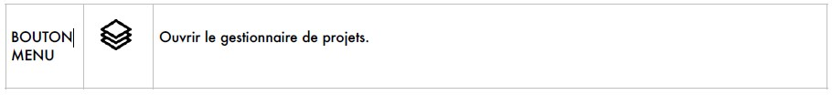

# Gestion des projets

 Ce bouton affiche la liste des projets connus par Annotate-on :
- soit parce qu’ils ont été créés dans cet ordinateur
- soit parce que présents dans un répertoire cloud ils ont été ajoutés dans cet Annotate-on
Chaque projet peut être installé n’importe où dans l’ordinateur.

